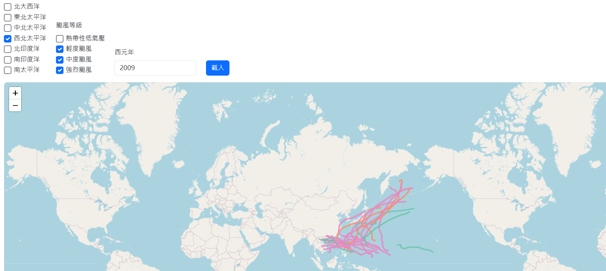
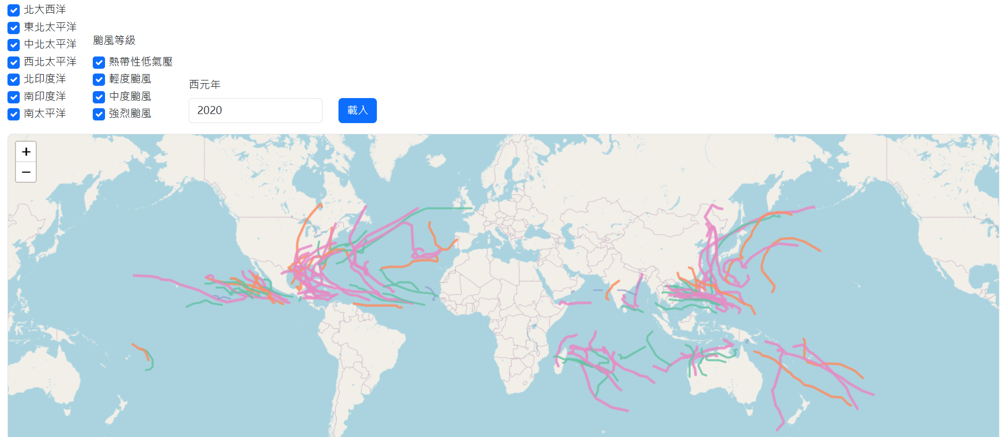

# 全球颱風路徑地圖 (Global Typhoon Map)

## 簡介 (Introduction)
這是一個使用 **Flask + Leaflet.js** 製作的互動式網頁應用程式，  
可以查詢並顯示 **全球各大洋盆地的颱風/熱帶氣旋路徑**。  

This is an interactive web application built with **Flask + Leaflet.js**,  
allowing users to query and visualize **typhoon/tropical cyclone tracks across global ocean basins**.

---

## 🖼️ 專案展示 (Demo Screenshots)

### 西北太平洋颱風路徑 (Western North Pacific Tracks)

### 全球颱風分佈 (Global Distribution)

---

## 功能特色 (Features)
- 🌏 支援多個盆地選擇 (北大西洋、西北太平洋、南印度洋等)  
- ⏳ 可篩選年份 (1990–2024)  
- 🌪️ 按強度等級篩選颱風 (熱帶低壓、輕度颱風、中度颱風、強烈颱風)  
- 📊 資料來源：**NOAA IBTrACS** 全球颱風最佳路徑資料集  

- 🌏 Supports multiple basins (North Atlantic, Northwest Pacific, South Indian Ocean, etc.)  
- ⏳ Filter by year (1990–2024)  
- 🌪️ Filter typhoons by intensity (TD, TS, STS, TY)  
- 📊 Data source: **NOAA IBTrACS** global tropical cyclone best track dataset  

---

## 使用方式 (Usage)
1. 安裝所需套件 (Install dependencies):  
   pip install -r requirements.txt

2. 啟動應用程式 (Run the app):
   python app.py

3. 在瀏覽器中開啟 (Open in browser):
   http://127.0.0.1:5000

4. 打包成執行檔 (Packaging as EXE)
    使用 PyInstaller 打包：  
    python -m PyInstaller typhoon-map.spec

   產生的執行檔會在 dist/ 目錄下。  
   The executable will be generated under the dist/ folder.

---

## 專案背景 (Background)
這是作者使用 vibe coding 方式完成的第一個練習專案。
未來將持續改善功能，例如：整合即時颱風 API、支援更多互動篩選功能。

This is the author's first practice project built with vibe coding.
Future improvements may include integrating real-time typhoon APIs and adding more interactive features.

---

## 授權 (License)

本專案採用 MIT License。
This project is licensed under the MIT License.
